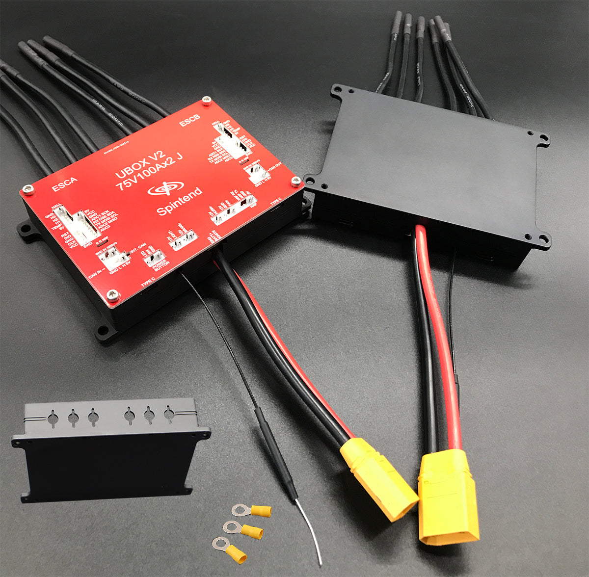
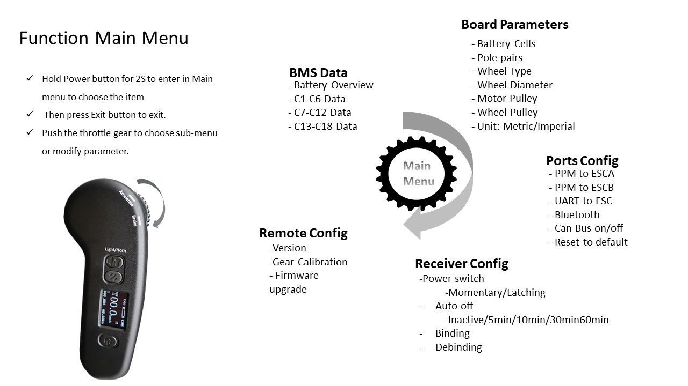

# Controles

## ESC — Spintend Ubox V2 75V 100A

- **Modelo**: UBOX_V2_75 (x2 J — dual)
- **Topologia**: Dual ESC (dois canais independentes)
- **Tensão**: 16–75V (pico < 80V)
- **Corrente máxima**: 100A por canal / 200A total
- **Dimensões**: 130 × 83 × 27mm / 396g
- **Saída 12V**: máx 3A (luz + buzina)
- **Saída 5V**: máx 500mA
- **Firmware**: v6.06 (base VESC)

## Controle Remoto — Spintend Uni1 V2

- **Tela**: OLED (dados em tempo real)
- **Bateria**: Lithium 450mAh (~11h de duração)
- **Frequência**: 2.4GHz
- **Protocolo**: PPM ou UART (configurável)
- **CanBus**: On/Off pelo controle
- **Botão extra**: luz de freio / farol / buzina
- **Firmware**: Bootloader, suporte a atualização online

## Exportar Configurações (VESC Tool v6.06)

1. Conecte o ESC via USB
2. Vá em **File → Export full configuration**
3. Salve o XML em `configs/`
4. Para dual: exporte motor 1 e motor 2 separadamente

## Restaurar Configurações

1. Conecte o ESC via USB
2. Vá em **File → Import full configuration**
3. Selecione o arquivo XML
4. Apply e escreva na flash
