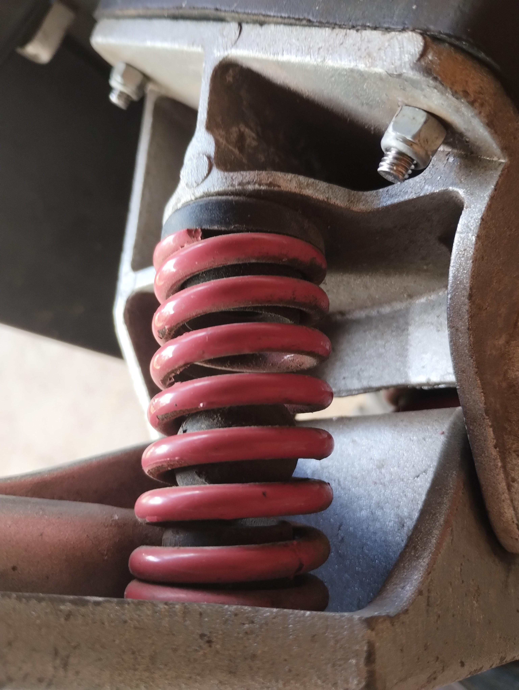

# Suspensão

## Amortecedor

- **Mola — diâmetro do arame (d)**: 4.5mm
- **Mola — folga entre espiras**: 3.5mm (passo = 8mm)
- **Mola — diâmetro externo (De)**: 30.7mm
- **Mola — comprimento livre (L0)**: 57.5mm
- **Borracha central**: bola de borracha no meio do amortecedor com curso de ~35mm

## Problema identificado

Em terreno com muitas pedras, o skate vibra excessivamente em alta frequência. O pré-load da mola está adequado (boa estabilidade em curvas), então o problema não é rigidez da mola, mas falta de amortecimento para vibrações de alta frequência.

## Solução planejada — batente TPU impresso

A borracha é solta dentro da mola — só entra em contato quando a suspensão atinge o fim do curso (bump stop). A borracha cumpre bem seu papel de batente, mas nunca foi projetada para absorver vibrações de alta frequência.

Substituir por um batente impresso em TPU, com vantagens sobre a borracha original:

1. **Absorção progressiva de fim de curso** — geometria vazada (gyroid, favo de mel) comprime progressivamente: mole no início do contato, endurece conforme comprime, evitando impacto abrupto metal a metal
2. **Amortecimento de alta frequência** — TPU dissipa energia por histerese do material, reduzindo vibração transmitida ao piloto
3. **Ajuste por infill%** — sem trocar filamento, só ajustando a densidade de impressão

### Considerações de design

- **Material**: TPU flexível, Shore A 85–95
- **Geometria**: estrutura interna vazada (gyroid recomendado para compressão progressiva)
- **Dimensões**: deve caber no curso de ~35mm da borracha original
- **Iteração**: imprimir variações de infill% e testar em campo
