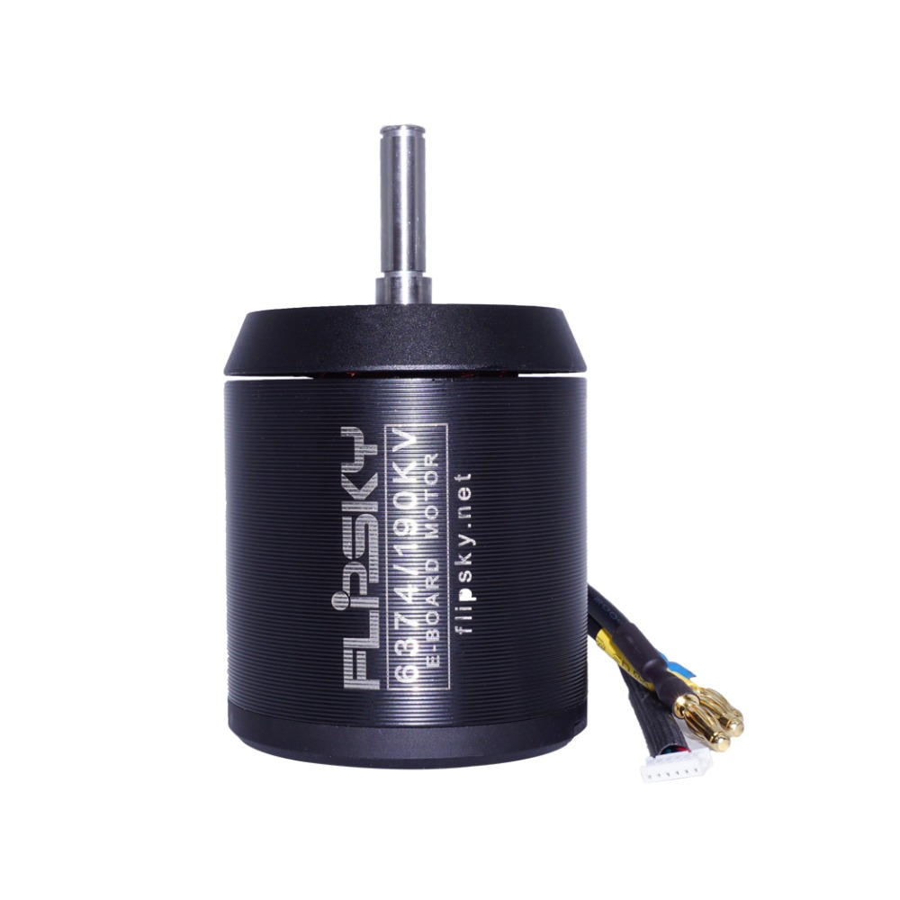
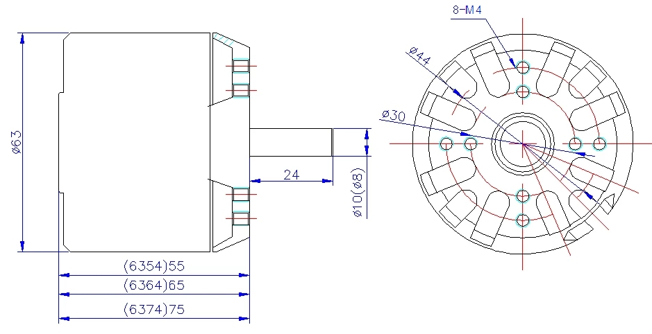
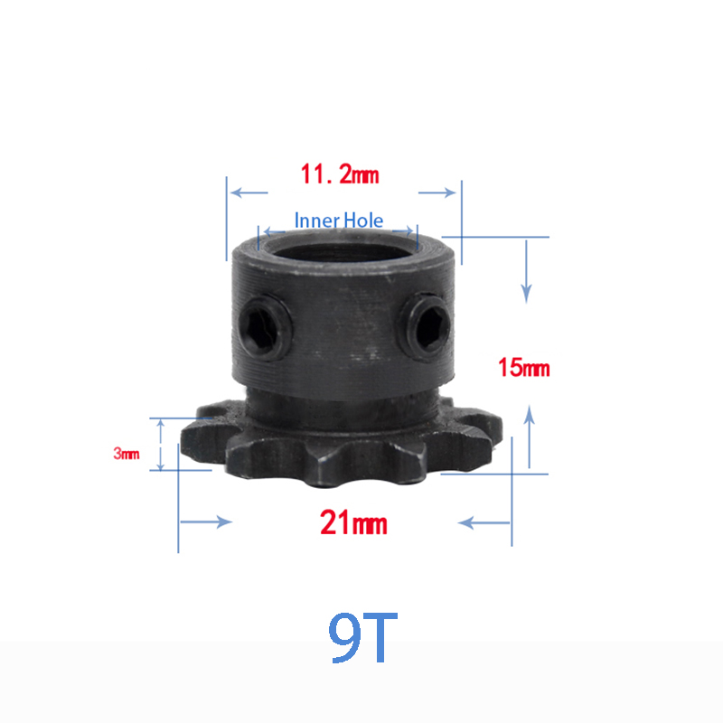
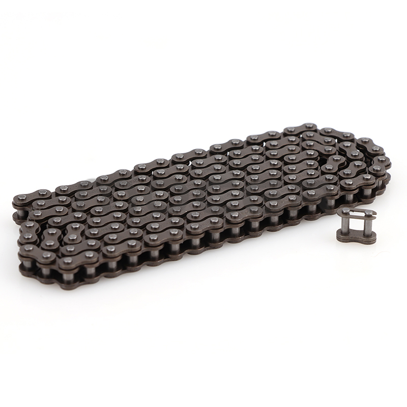
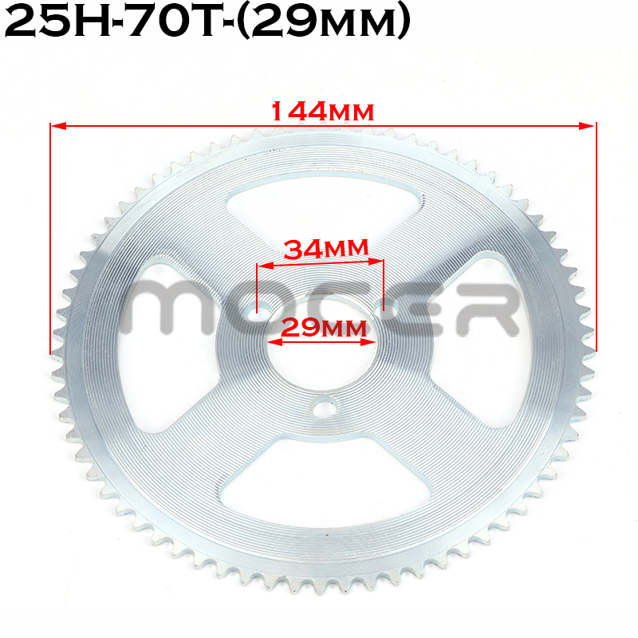
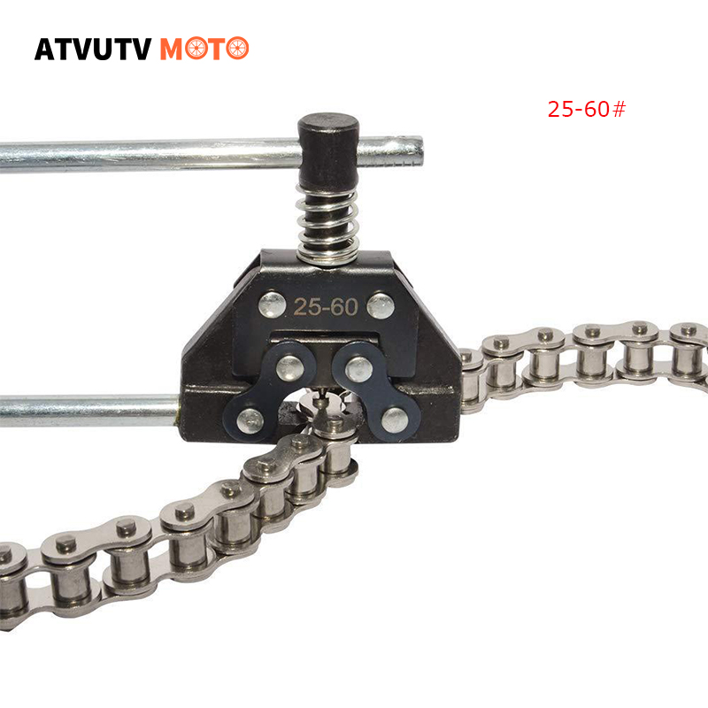

# Trem de Força

## Motor — Flipsky BLDC 6374 190KV

- **Tipo**: Brushless DC (BLDC), sensorless / Hall
- **KV**: 190KV
- **Potência**: 3250W cada (x2)
- **Corrente máx**: 85A
- **Tensão máx**: 12S (50.4V)
- **Torque máx**: 8Nm
- **Resistência**: 0.05 Ohm
- **Polos**: 14 (7 pares)
- **Ímãs**: N42SH
- **Eixo**: 8mm x 32mm, chaveta 3x3x20mm
- **Peso**: 0.86kg cada
- **Dimensões**: 63mm x 74mm
- **Proteção**: À prova d'água e à prova de poeira

## Transmissão — Chain Drive

- **Tipo**: Corrente (chain drive)
- **Pinhão do motor**: 04C, 9T, furo 8mm, aço 45#
- **Coroa da roda**: 25H, 70T, 29mm (original: 47T — trocada por mais torque)
- **Relação de marcha**: 7.78:1

## Velocidade Máxima Teórica

| Condição | Velocidade |
|---|---|
| Nominal (59.2V) | 70.9 km/h |
| Carga cheia (67.2V) | 80.4 km/h |
| Estimada na prática (~80%) | 57–64 km/h |

> Cálculo: 190KV × 59.2V = 11.248 RPM → ÷ 7.78 = 1.446 RPM roda → × π × 0.260m = 70.9 km/h
